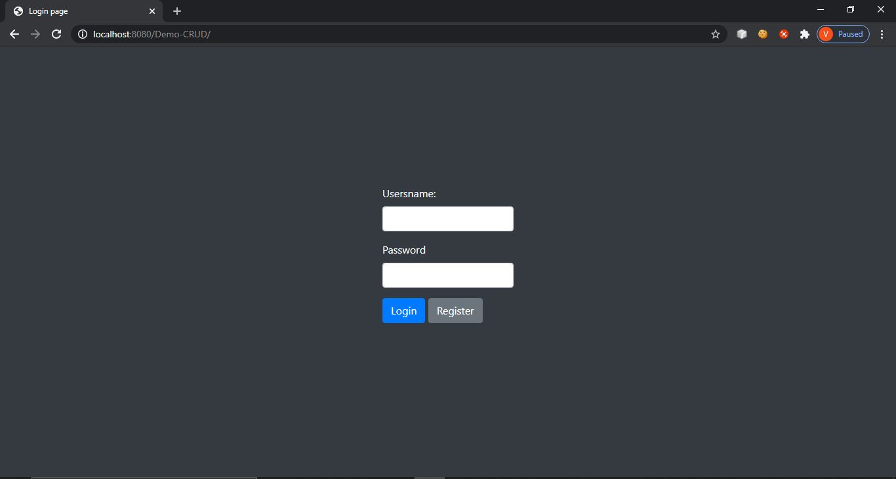
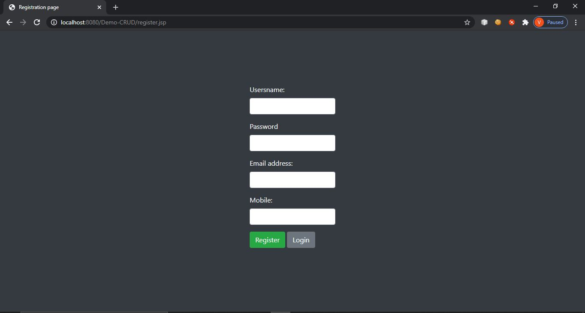
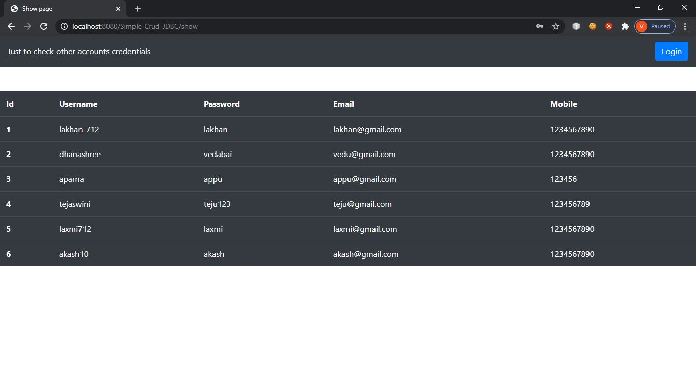
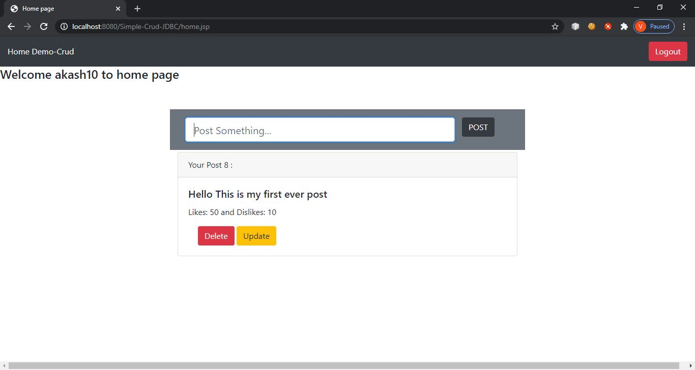
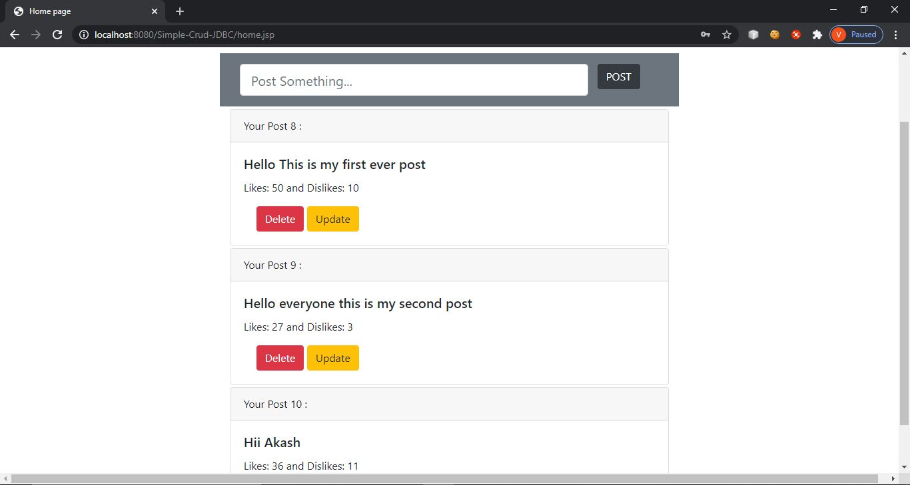
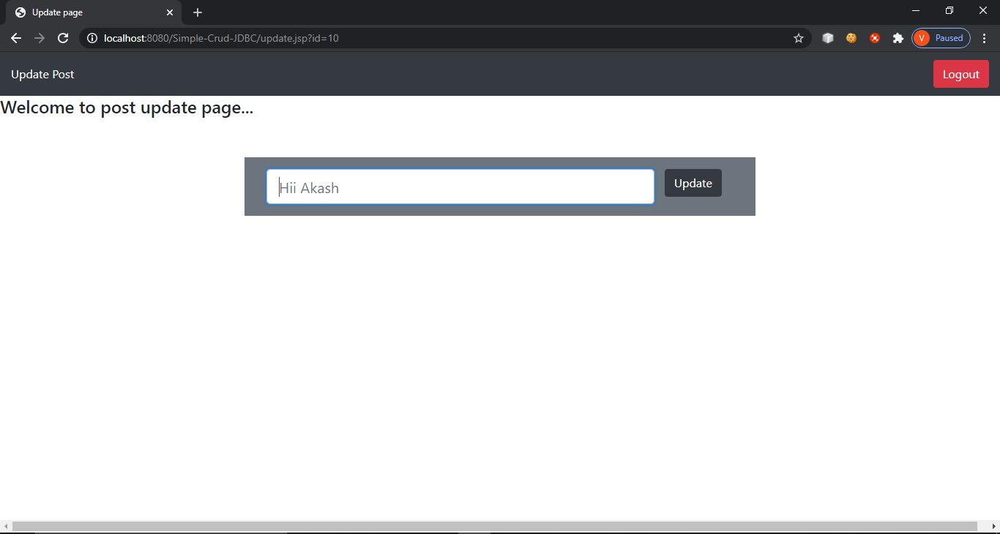

# Simple-Blogging-CRUD-using-JDBC

In this project peoples can share their posts and thoughts also they can use it as storing important notes.

# Modules:

<b>1. Login Page:</b> 
People can login here.<b>

<b>2. Registration Page:</b> 
People can Register themself here.

<b>3. Show Page:</b> 
All users data (credentials) they can see here.

<b>4. Home Page:</b> 
Where people can see their posts also they can share their posts here.

<b>5. Update Page:</b> 
People can update their previous posts here.

